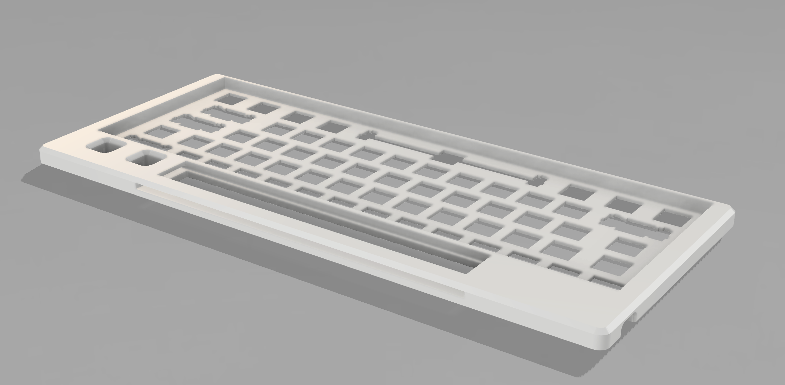
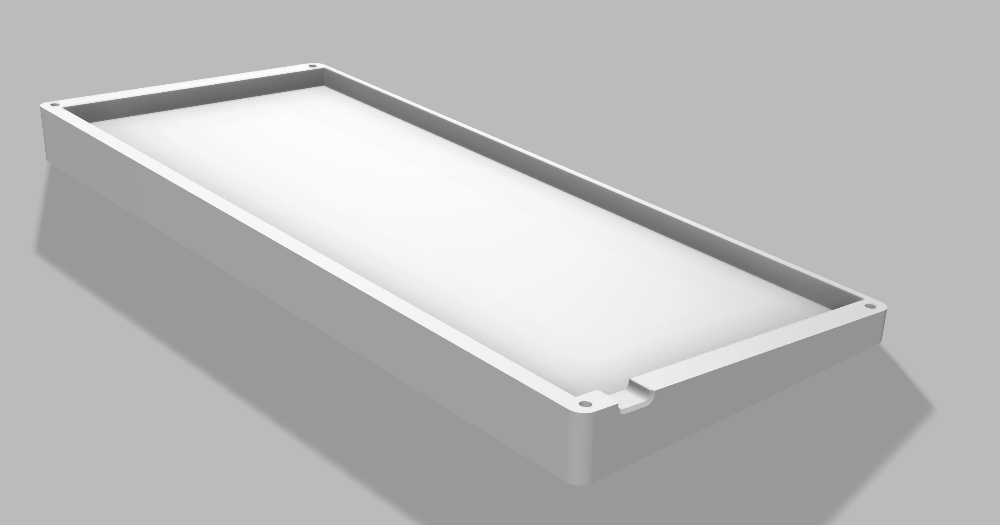
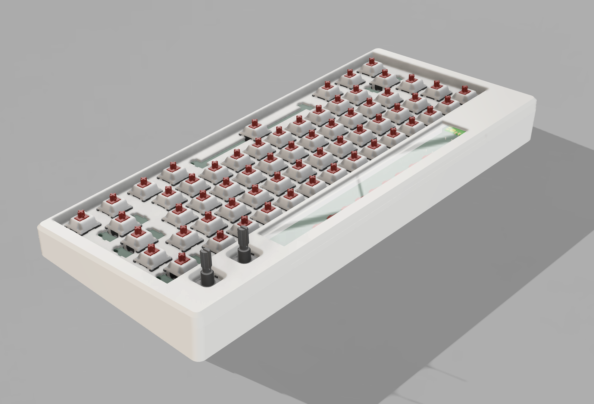
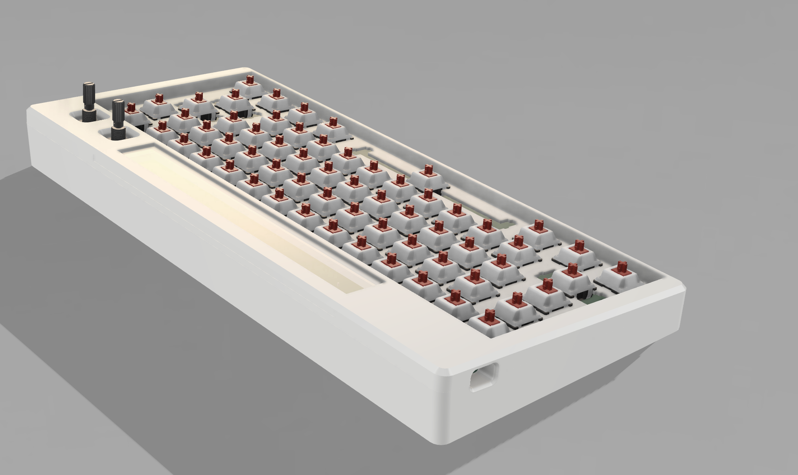

# keyboard - v2

Made by [Daamin](https://daamin.tech)

Features:

- 61x keys!
- Default 60% Layout
- 2x EC11 Rotary Encoder - For Volume, Brightness etc
- 9x LEDs with acrylic for aesthetics (multicolor)
- COOOL Silkscreen
- Comfy Design
- KMK firmware

## Info

I made this keyboard since I wanted a compact alternative to my bigger keyboard, this keyboard is pretty small in size and has most of the necessary keys. I also wanted to make this one look aesthetically pleasing instead of my old keyboard which did not look really good 😭.

It has 9x LEDs, out of which 3 are Red, Blue and Green. I did not use neopixels since PCBA is a bit expensive, and SMD soldering is out of my league for now.

In order to mount the acrylic sheet that is on top of the cutout, I designed a 3D printed part that will be super glued to hold it in place.

I will be using a cool green gradient keycaps, which will blend really well with the white case and the black PCB. The PCB will be visible from the LED cutout. The silkscreen also looks very good and is Harry Potter Themed.

## PCB

The PCB's size is 290.9mm x 123.4mm

| Schematic                 |
| ------------------------- |
|  |

| Front                 |
| --------------------- |
|  |

| Back                 |
| -------------------- |
|  |

| 3D - Front               |
| ------------------------ |
|  |

| 3D - Back               |
| ----------------------- |
|  |

## Case

Thickness:-

- Top: 8.5mm
- Bottom: 11mm
- **Total**: 19.5mm
  
  
  
  

The case was made in Fusion360.
The last image is of the 3D printed part to hold the acrylic sheet in place.
I chose to add branding on the bottom case only for aesthetics.

## 3D Render:

## Layout:

The Layout is a Default 60%.

## BOM

| Name                                                                  | Qty | Final Price - INR (USD) | Link                                                                                                       |
| --------------------------------------------------------------------- | --- | ----------------------- | ---------------------------------------------------------------------------------------------------------- |
| Gateron EF Grayish                                                    | 70  | 1465 ($17.14)           | [here](https://neomacro.in/products/gateron-ef-grayish)                                                    |
| Cherry Profile PBT Keycaps                                            | 1   | 1299 ($15.14)           | [here](https://stackskb.com/store/veekos-gradient-keycaps-cherry-profile-135-keys)                         |
| Durock Smokey Screw-In Stabilizers V2 (4+1 w/ 6.25u spacebar)         | 1   | 1595 ($18.6)            | [here](https://stackskb.com/store/durock-smokey-screw-in-stabilizers-v2/)                                  |
| Diode 1N4148 Through - Hole                                           | 80  | 188.8 ($2.21)           | [here](https://roboticsdna.in/product/diode-1n4148/)                                                       |
| EC11 Rotary Encoder                                                   | 2   | 178 ($2.08)             | [here](https://amzn.in/d/hVRxzij)                                                                          |
| M3 x 20mm Bolt                                                        | 20  | 56.64 ($0.66)           | [here](https://roboticsdna.in/product/easymech-set-of-m3-x-20mm-allen-bolt-20-pieces/)                     |
| M3 x 4mm Heatset Insert                                               | 25  | 242 ($2.83)             | [here](https://amzn.in/d/dpL3N2a)                                                                          |
| PCB - (Black Color)                                                   | 5   | 3802.44 ($44.5)         | [here](https://hc-cdn.hel1.your-objectstorage.com/s/v3/3f05c160f070155d4d5333c6b8261f5120b33c4c_image.png) |
| Raspberry Pi Pico                                                     | 1   | 366.01 ($4.28)          | [here](https://roboticsdna.in/product/raspberry-pi-pico/)                                                  |
| Super Bright Red LED 5MM (5 Pieces)                                   | 2   | 48 ($0.56)              | [here](https://roboticsdna.in/product/super-bright-red-led-5mm-5-pieces/)                                  |
| Super Bright Blue LED 5MM (5 Pieces)                                  | 2   | 30 ($0.35)              | [here](https://roboticsdna.in/product/super-bright-blue-led-5mm-5-pieces/)                                 |
| Super Bright Green LED 5MM (5 Pieces)                                 | 2   | 24 ($0.28)              | [here](https://roboticsdna.in/product/super-bright-green-led-5mm-5-pieces/)                                |
| 330K Ohm 0.25W CFR Resistor ±5% Tolerance (Pack of 50 )               | 1   | 29.5 ($0.35)            | [here](https://roboticsdna.in/product/330k-ohm-0-25w-cfr-resistor-%c2%b15-tolerance-pack-of-50/)           |
| Acrylic Sheet                                                         | 1   | 240 ($2.81)             | [here](https://amzn.in/d/05dUxqd)                                                                          |
| Rotary Encoder Knob                                                   | 2   | Print Legion            |
| Top Case - 1 (White "./production/top.step")                          | 1   | Print Legion            |
| Bottom Case - 1 (White "./production/bottom.step")                    | 1   | Print Legion            |
| Acrylic Sheet Mount - 1 (White "./production/acrylic-sheet-lid.step") | 1   | Print Legion            |

## Total Pricing

The keyboard comes out to be 9,564 INR ($111.96) when adding ordered parts and PCB. Does not include 3D - Printed case, Pico and Knob.
PS:- (Seed Studio costs $142 )
I have chose "air registered mail" over "UPS World Saver" because air registered mail is less likely to get customs even if it is more expensive.

## Notes :-

I want all the five 3D-printed parts to be printed in white color.

Some of the above items, were ordered in packs due to unavailability of singular items.
The pricing might slightly vary due to flash sales, and dollar market trends.
